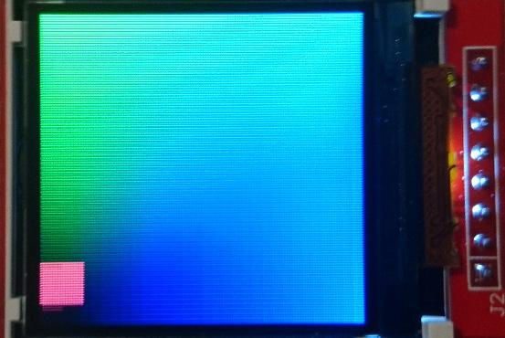

# ST7735 screen on FPGA iCE40

Verilog implementation for the ST7735 screen controllers.

A green-blue static gradient is drawn on the screen, to display the refresh rate of the implementation a red square is moving and bouncing
on the sides of the screen.

This particular implementation uses a 128x128 pixels ST7735 screen, but a larger screen can be used by changing the constants in the code and
by incresing the size of the framebuffer memory (within the limit of the FPGA memory), each pixel is 16bit (5R,6G,5B).

This project is running on a breakout board with an ice40 ultraplus from lattice, see the root project README for instructions to build.

## Implementation

The screen controller is composed of a framebuffer of 256Kb (itself composed of two iCE40 SPRAM) and an interface to the ST7735.   
The interface will send an inital stream of commands to initialise the screen (such as the size of the displayed area) and will draw the screen black,
then the interface will just wait for pixels to be sent to the screen. The screen controller which handles the interface and the memory will
read the pixels from the memory and write them to the interface.   
If the controller receives a write request to the framebuffer, it will pause the memory read to the interface.

Since the ST7735 doesn't have to receive the pixels in a continuous stream, it will not make the image stutter.

The whole system is running at 24MHz and the wire interface to screen is running at 8MHz.

## Pin plan

| pin on the screen | pin on fpga | description |
|---|---|---|
| SCK | 48B | Clock to the screen, set at 8Mhz |
| SDA | 42B | MOSI, SPI data to the screen |
| CS | 39A | Chip select, active low |
| RESET | 38B | Resets the screen |
| A0 | 43A | D/C, defines if the incoming data to the screen is a command (0) or data (1) such as pixels  |
