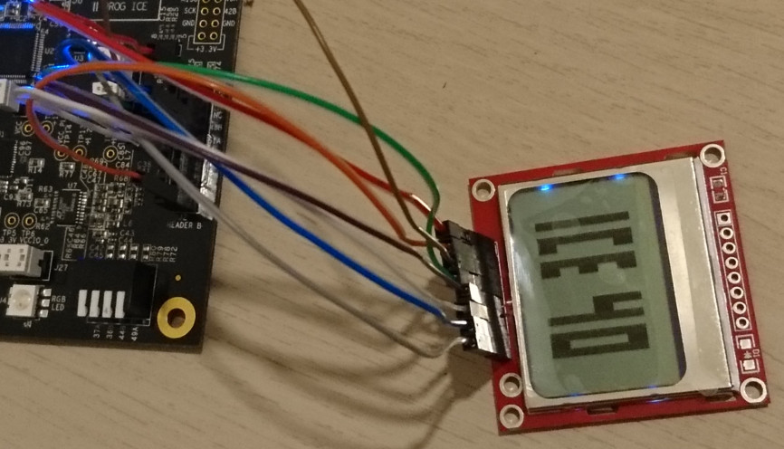

# Nokia 5110 screen on iCE40 Ultraplus

Sparkfun offers nokia 5110 screens: https://www.sparkfun.com/products/10168   
They have a low resolution (84x48, monochrome) but it means it can be easily implemented on an ice40 ultraplus.

The framebuffer to be displayed on screen (4032 bits) is stored in BRAM and is transferred to the screen with an interface similar to SPI.

The project is composed of the screen controller (`screen_controller.v`) which will initialise and draw pixels on the screen. The module also contains the framebuffer which will be drawn on the screen (84x48 monochrome). Pixels can be written to the module via the simple interface (write column by column to the module).

The pixels can only be pushed sequentially on the screen, there is no way to modify only a pixel or a line, the whole scren has to be redrawn to make a single change. There is also no way to access the framebuffer in the screen. This is why the screen_controller has an internal framebuffer made of BRAMs (it fits in 3 BRAMs).

## Pin plan

| pin on the screen | pin on fpga | description |
|---|---|---|
| SCE | 39A | Chip select, active low, always at 0 in this example |
| RST | 38B | Reset, active low, is held low for a few 100's of microseconds at the start |
| D/C | 43A | Selects wether a byte send to the screen is a command or data(pixels), 1 means that the bytes are data |
| DN(MOSI) | 42B | The bits which will either be commands or pixels |
| SCLK | 48B | The clock provided by the fpga, the datasheet for the screen says that it can handle 4MHz, but 1MHz is used in this example |

The data sheet for the screen detailing the interface and registers is available here: https://www.sparkfun.com/datasheets/LCD/Monochrome/Nokia5110.pdf
